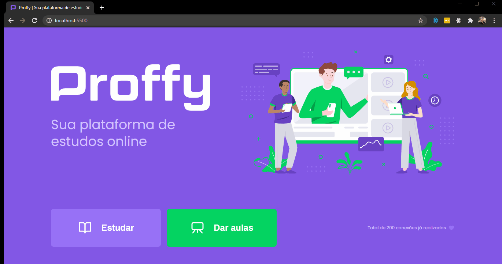

# Proffy

Proffy is a study platform, in which it is possible to choose teachers to study different subjects or teach classes.  
Application developed during the second edition of the [Rocketseat](https://rocketseat.com.br/) event, the Next Level Week (nlw#02).<br><br>       

<h2>
    <g-emoji class="g-emoji" alias="desktop_computer" fallback-src="https://github.githubassets.com/images/icons/emoji/unicode/1f5a5.png">🖥</g-emoji>
    Preview
</h2>  

<div align="center">
      
      
      
</div>

<br>

## Technologies

Frontend:
<ul>
<li> <a href="https://www.w3schools.com/html/">HTML</a> </li>
<li> <a href="https://www.w3schools.com/css/">CSS</a> </li>
<li> <a href="https://developer.mozilla.org/pt-BR/docs/Web/JavaScript">JavaScript</a> </li>
<li> <a href="https://mozilla.github.io/nunjucks/">Nunjucks</a> </li>
</ul>

Backend:
<ul>
<li> <a href="https://nodejs.org/en/">Node.js</a> </li>
<li> <a href="https://expressjs.com/">Express</a> </li>
<li> <a href="https://www.sqlite.org/index.html">SQLite</a></li>
</ul>

<br>

## Install e configuration

To clone repository:  

```sh
git clone git@github.com:cesarramos95/proffy-nlw-02.git
```
<br>

After clonning the repository, execute the command bellow to install the necessary dependences and to download the node_modules folder:  

```sh
npm install
```
<br>

## How to run
```sh
npm run dev
```
<br>

## How to test the application
 After to start local server open your browser at http://localhost:5500 to run the app.